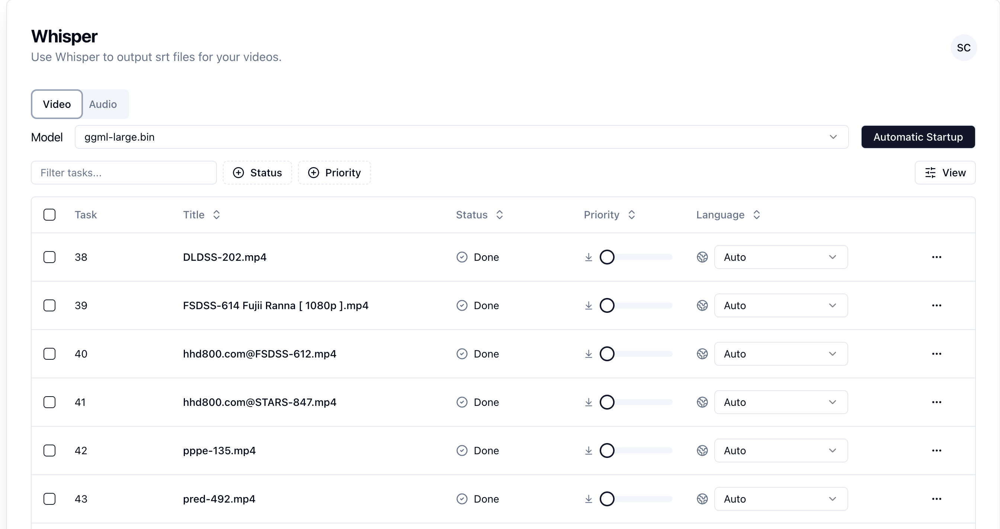

# GPT-Subtitle :speech_balloon: :globe_with_meridians:

<div align="center">

[](https://github.com/hqwuzhaoyi/gpt-subtitle/actions/workflows/build.yml) [](https://app.fossa.com/projects/git%2Bgithub.com%2Fhqwuzhaoyi%2Fgpt-subtitle?ref=badge_shield&issueType=license)

</div>

[English](./README.md) | 简体中文



[查看当前开发任务](https://hqwuzhaoyi.notion.site/gpt-subtitle-b1eed463063a484f93bdfca91277fc3a?pvs=4) :clipboard:

GPT-Subtitle 结合了 [Whisper](https://github.com/ggerganov/whisper.cpp) 和 [OpenAI](https://openai.com/) 的 [GPT-3 语言模型](https://openai.com/gpt-3/) :brain:，为你提供音频和视频的本地翻译功能。不仅能够将字幕转换成对话并进行翻译，而且支持多种语言的翻译，并能方便地将字幕翻译成其他语言。 :artificial_satellite:


## :sparkles: 主要特性:

通过接入 [whisper.cpp](https://github.com/ggerganov/whisper.cpp) 模型，现在你可以:

- 扫描文件夹内的视频和音频，并转换成 srt 字幕文件 :mag: :film_strip: :headphones:
- 利用优化算法进行多语言字幕文件的翻译 :speech_balloon: :globe_with_meridians:

## :wrench: 技术栈

- NextJS 13 (App Router)
- NestJS
- Jotai
- Framer Motion
- Radix UI
- Socket.IO
- TailwindCSS

## 运行环境

本项目基于 Node.js 平台，因此需要在本地首先安装 Node.js。安装完成后，请打开命令行工具，进入项目根目录，然后安装 pnpm 和项目所需的依赖：

```sh
pnpm install

```

安装 whisper

```sh
sh setup-whisper.sh
```

安装 ffmpeg,其他系统请自行安装

```sh
brew install ffmpeg
```

也需要安装 redis 和 mysql，其他系统请自行安装

```sh
brew install redis
brew install mysql
```

## 使用方法

### 设置 API KEY

在使用翻译功能之前，你需要先在 [OpenAI 官网](https://beta.openai.com/signup/) 注册账户，然后申请 API KEY。在获得 API KEY 后，可以在根目录下从`.env.template`拷贝一个名为 `.env` 的文件，并在其中添加如下配置：

```sh
OPENAI_API_KEY= # OpenAI API KEY
GOOGLE_TRANSLATE_API_KEY= # Google API KEY(Can be left blank)
BASE_URL= # OpenAI API URL
WEB_PORT=3000 # Front-end port
SERVER_PORT=3001  # Backend port

STATIC_PATH=/static # Static file path
OUTPUT_SRT_THEN_TRANSLATE=true # Whether to output the SRT file first and then translate it
LANGUAGE=zh-CN # Output SRT file and then translate the language
TRANSLATE_DELAY=1500 # Delay between calling translation interface
TRANSLATE_GROUP=4 # Translate sentences for grouping translation, how many sentences can be translated at most at a time
TranslateModel=google # google or gpt3

REDIS_PORT=6379 # Redis port
REDIS_HOST=subtitle_redis # Redis address
MYSQL_HOST=subtitle_mysql # MySQL address
MYSQL_PORT=3306 # MySQL port
MYSQL_USER=root # MySQL user
MYSQL_PASSWORD=123456 # MySQL passowrd
MYSQL_DATABASE=gpt_subtitle # MySQL Database name

API_URL=http://localhost:3001 # Backend API address
NEXT_PUBLIC_API_URL=http://localhost:3001 # Same as above. Backend API address
WEB_URL=http://localhost:3000 # Web address
NEXT_PUBLIC_WEB_URL=http://localhost:3000 # Same as above. WEB address
```

### 运行程序

本地部署服务

```sh
npm run deploy:prod
```

## :whale: Docker 部署

### :books: docker-compose

1. change the args inside `docker-compose.yml`

   ```text
   args:
        - WEB_PORT=3000
        - SERVER_PORT=3001
        - API_URL=http://localhost:3001
        - STATIC_PATH=/static
   ```

2. run command

```bash
docker-compose up -d
```

## setup-whisper

`setup-whisper.sh` ,安装 whisper 脚本

可以选择下载的模型,把 make 之前的注释去掉即可

```sh
# more info about whisper.cpp: https://github.com/ggerganov/whisper.cpp
# make tiny.en
# make tiny
# make base.en
# make base
# make small.en
# make small
# make medium.en
# make medium
# make large-v1
# make large
```

模型越大，翻译效果越好，但是速度越慢，建议除了英语使用 large 模型

Nvida GPU 可以加速模型的运行，但是需要安装 CUDA，详情见 [whisper](https://github.com/ggerganov/whisper.cpp) 项目的说明
