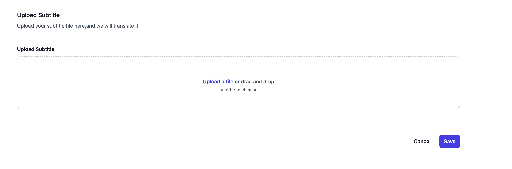
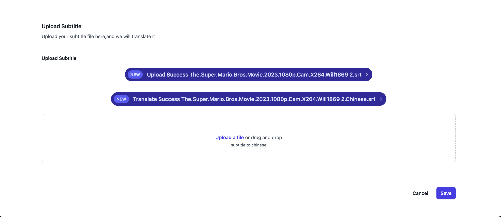

# Using OpenAI to Translate Subtitles

[Current development tasks](https://hqwuzhaoyi.notion.site/gpt-subtitle-b1eed463063a484f93bdfca91277fc3a?pvs=4)

This project uses OpenAI's GPT-3 language model to provide online translation of subtitles, supporting multiple languages. It makes it easy to translate English subtitles into subtitles in other languages.





## System Requirements

This project runs on the Node.js platform, so you need to install Node.js first. After installing Node.js, you need to open the command-line tool, navigate to the project root directory, and install pnpm, then install the dependencies required for the project using the following command:

```sh
pnpm install
```

## Usage

### 1. Set up API Key

Before using the translation feature, you need to register an account on the [OpenAI website](https://beta.openai.com/signup/) and apply for an API key. After obtaining the API key, you can create a file named `.env` in the root directory and add the following configuration:

```sh
OPENAI_API_KEY=
GOOGLE_TRANSLATE_API_KEY=
BASE_URL=
WEB_PORT=3000
SERVER_PORT=3001
NEXT_PUBLIC_SERVER_PORT=3001
STATIC_PATH=/static
LANGUAGE=Chinese
OUTPUT_SRT_THEN_TRANSLATE=true
```

Replace `your_api_key` with your own API key.

### 2. Run Translation Task

### Start the web application

```sh
npm run dev
```

### Or using command line tasks

This project provides a script file `translate.ts` for executing translation tasks. Enter the following command in the command line to start translation:

```sh
npx ts-node src/translate.ts -i The.Super.Mario.Bros.Movie.2023.1080p.Cam.X264.Will1869.srt -o output.srt -l Chinese
```

The subtitle folder is located in `test_subtitles`.

`input.srt` is the input English subtitle file name, and `Chinese` is the target language for translation output. You can modify the `l` parameter as needed.

After the translation is completed, you will see the translated subtitles in the `output.srt` file. If an error occurs during the runtime, please check if the input file path is correct and if the OpenAI API key has been configured correctly.
